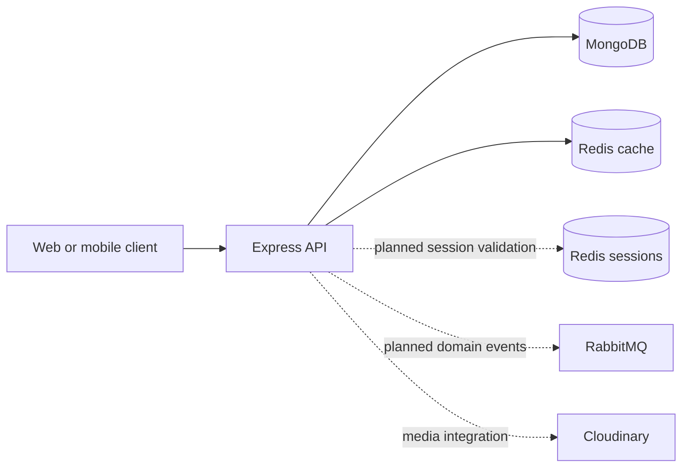

<p align="center">
	
</p>

# Campus Chronicle

A community publishing platform for VIT Chennai, built to share the ideas, people, and stories shaping campus life. This repository contains the backend API, powered by MongoDB and Redis, with RabbitMQ planned for asynchronous messaging.

## Technology Stack

| Layer | Technology |
| --- | --- |
| Runtime | Node.js with native ES modules |
| HTTP API | Express 5 |
| Primary datastore | MongoDB with Mongoose 9 |
| Cache and in-memory data store | Redis 7 with ioredis |
| Message broker (planned) | RabbitMQ with `rabbitmq-client` |
| Authentication building blocks | bcrypt, JSON Web Token (JWT), cookie-parser |
| Media integration | Cloudinary, Multer |
| Local development | Docker Compose, Nodemon |

## Architecture



MongoDB is the source of truth for users and posts. Redis accelerates frequently requested blog data and is intended for authentication-session storage. RabbitMQ is the planned message broker. Session management and messaging are not wired into the current API yet.

## Redis: Cache, Sessions, Messaging

### Blog caching in place

The API uses a cache-aside pattern for blog reads:

- `GET /api/v1/blogs/getPosts` reads `blogs:all` from Redis first, then MongoDB on a cache miss.
- `GET /api/v1/blogs/getBlog/:id` uses a per-post key (`blog:<id>`) so one post cannot be returned for another post's ID.
- Cached values expire after one hour.
- Creating a post invalidates `blogs:all`, preventing the list endpoint from continuing to serve an old collection after a write.

### Session management direction

JWT and bcrypt dependencies are available, but login, refresh, logout, and Redis-backed session validation have not yet been implemented. A planned design is to store a short-lived session record in Redis for each login, keyed by a unique session ID and expiring with the refresh-token lifetime. HttpOnly cookies can carry the access and refresh tokens; middleware can verify the access JWT and confirm its session remains active in Redis. Refresh-token rotation and deleting the Redis session on logout enable revocation before token expiry.

Passwords should be hashed with bcrypt and persisted in MongoDB. Redis should contain session metadata only, never passwords or password hashes. Checking Redis on authenticated requests enables immediate revocation, with the tradeoff that protected endpoints depend on Redis availability.

## RabbitMQ: Messaging Roadmap

RabbitMQ is planned for asynchronous application events such as `post.created`, allowing the API to hand off work to independent consumers for notifications, activity-feed updates, or media processing. Exchanges, routing keys, durable queues, publisher confirms, and acknowledgements can provide controlled routing and reliable processing. The `rabbitmq-client` dependency is installed, but broker connection setup, publishers, and consumers have not yet been implemented.

Redis remains responsible for fast blog caching and is the planned store for login-session metadata; RabbitMQ will handle asynchronous message delivery. Keeping those responsibilities separate lets each service address a distinct workload.

## API Routes

| Method | Route | Purpose |
| --- | --- | --- |
| `POST` | `/api/v1/signUp/register` | Register a user |
| `GET` | `/api/v1/users/getUsers` | List users |
| `POST` | `/api/v1/create/writePost` | Create a blog post |
| `GET` | `/api/v1/blogs/getPosts` | List blog posts |
| `GET` | `/api/v1/blogs/getBlog/:id` | Fetch a post by MongoDB ID |

## Run Locally

### Requirements

- Node.js and npm
- Docker with the Compose plugin, or a reachable Redis instance
- A reachable MongoDB instance

Create a `.env` file in the project root:

```env
PORT=8000
MONGODB_URI=mongodb://localhost:27017
REDIS_URL=redis://localhost:6379

# Optional: required only when using Cloudinary uploads
CLOUDINARY_CLOUD_NAME=
CLOUDINARY_API_KEY=
CLOUDINARY_API_SECRET=
```

The application appends the `blog` database name to `MONGODB_URI`. Use a MongoDB URI without a trailing database name, for example `mongodb://localhost:27017`.

Install dependencies and start the development server:

```bash
npm install
npm run dev
```

Alternatively, Docker Compose starts the API and Redis containers:

```bash
docker compose up --build
```

The Compose setup does not include MongoDB; configure `MONGODB_URI` in `.env` to point to a MongoDB instance reachable from the app container. When using a MongoDB service on the host, `localhost` inside the app container refers to the container itself, so use the appropriate host address or add MongoDB to Compose.

## Project Layout

```text
src/
	controllers/   Request handlers for users and posts
	db/            MongoDB connection
	middleware/    Request middleware
	models/        Mongoose user and post schemas
	redis/         Redis connection and shutdown lifecycle
	routes/        Express API routes
	utils/         API response, error, and upload utilities
```

## Current Scope

Implemented: user registration, post creation and retrieval, MongoDB persistence, Redis-backed blog caching, and graceful Redis shutdown.

Planned: password-based login, JWT cookie issuance and refresh, Redis session revocation, protected routes, and RabbitMQ publishers and consumers. The presence of authentication or messaging libraries in the dependency list does not mean those flows are active yet.

## Roadmap

Campus Chronicle will have a dedicated frontend for people who want to use the application directly. The API will also remain available to run locally for developers and anyone who prefers a self-hosted setup, alongside a planned globally accessible deployment for the hosted frontend. This provides both a ready-to-use web experience and the option to run your own local API instance.
