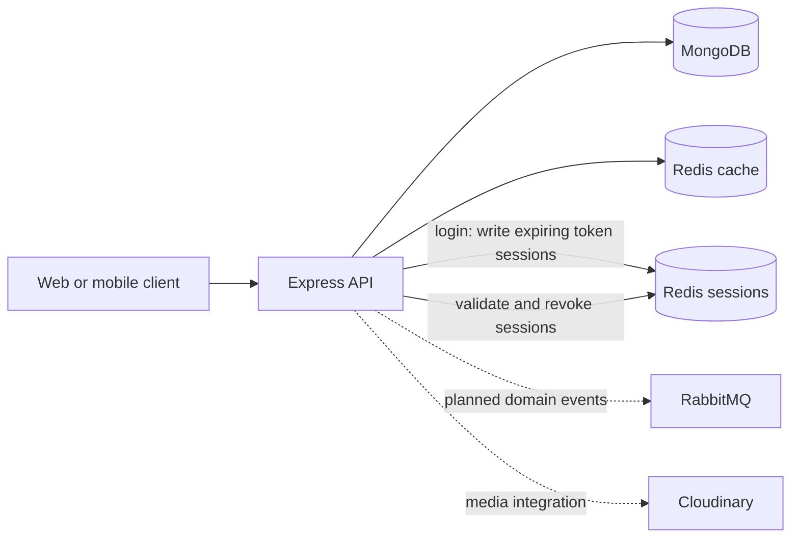

<p align="center">
	
</p>

# Campus Chronicle

A community publishing platform for VIT Chennai, built to share the ideas, people, and stories shaping campus life. This repository contains the backend API, powered by MongoDB and Redis, with RabbitMQ planned for asynchronous messaging.

## Technology Stack

| Layer | Technology |
| --- | --- |
| Runtime | Node.js with native ES modules |
| HTTP API | Express 5 |
| Primary datastore | MongoDB with Mongoose 9 |
| Cache and in-memory data store | Redis 7 with ioredis |
| Message broker (planned) | RabbitMQ with `rabbitmq-client` |
| Authentication building blocks | bcrypt, JSON Web Token (JWT), cookie-parser |
| Media integration | Cloudinary, Multer |
| Local development | Docker Compose, Nodemon |

## Architecture



MongoDB is the source of truth for users and posts. Redis accelerates frequently requested blog data and stores expiring access- and refresh-token session records created during login. Access-token requests are checked against Redis, and logout removes the current session records. Refresh-token renewal and RabbitMQ messaging are not implemented yet.

## Redis: Cache, Sessions, Messaging

### Blog and comment caching in place

The API uses a cache-aside pattern for read-heavy endpoints:

- `GET /api/v1/blogs/getPosts` reads `blogs:all` from Redis first, then MongoDB on a cache miss.
- `GET /api/v1/blogs/getBlog/:id` uses a per-post key (`blog:<id>`) so one post cannot be returned for another post's ID.
- `GET /api/v1/comment/getComments/:postId` reads `comments:post:<postId>` from Redis first, then queries MongoDB and populates each commentAuthor with the author username before caching the result.
- Cached values expire after one hour.
- Creating a post invalidates `blogs:all`, and creating a comment invalidates both `comments:post:<postId>` and `blog:<postId>` to prevent stale list and detail responses.

### Login sessions and access-token revocation

`POST /api/v1/loginUser/login` checks the user's password, creates access and refresh JWTs with unique `jti` values, writes session records to Redis under `session:access:<jti>` and `session:refresh:<jti>`, and sets both tokens in HttpOnly cookies. Each Redis record currently contains the user ID, username, email, full name, token type, `jti`, and issue time. Redis TTLs and cookie lifetimes are derived from the day-based expiry settings.

`verifyJWT` verifies access-token signatures and expiry, checks that the token is an access token, and requires its matching Redis session record to exist and match the token and user. The middleware attaches the verified access-token `jti` and user to the request for downstream handlers. `POST /api/v1/logout/logOut` and `POST /api/v1/users/logOut` use that `jti` to delete the access session; they also verify the refresh-token cookie and delete its session when it is valid and belongs to the same user, then clear both cookies.

Passwords are hashed with bcrypt and persisted in MongoDB. JWT strings are not stored in Redis or MongoDB; Redis stores session records. The login response currently also includes the raw tokens in its JSON body as well as cookies. For production, prefer returning only safe user details and relying on HttpOnly cookies. Refresh-token renewal has not been implemented, and the other API routes are not currently protected by `verifyJWT`.

## RabbitMQ: Messaging Roadmap

RabbitMQ is planned for asynchronous application events such as `post.created`, allowing the API to hand off work to independent consumers for notifications, activity-feed updates, or media processing. Exchanges, routing keys, durable queues, publisher confirms, and acknowledgements can provide controlled routing and reliable processing. The `rabbitmq-client` dependency is installed, but broker connection setup, publishers, and consumers have not yet been implemented.

Redis remains responsible for fast blog caching and is the planned store for login-session metadata; RabbitMQ will handle asynchronous message delivery. Keeping those responsibilities separate lets each service address a distinct workload.

## API Routes

| Method | Route | Purpose |
| --- | --- | --- |
| `POST` | `/api/v1/signUp/register` | Register a user |
| `POST` | `/api/v1/loginUser/login` | Log in; issue access and refresh tokens |
| `POST` | `/api/v1/logout/logOut` | Verify the access session, revoke its Redis records, and clear auth cookies |
| `POST` | `/api/v1/tokenRefresh/refresh-token` | Refresh the access token |
| `GET` | `/api/v1/users/getUsers` | List users |
| `POST` | `/api/v1/create/writePost` | Create a blog post |
| `POST` | `/api/v1/comment/writeComment/:postId/:userId` | Create a comment on a post by a user |
| `GET` | `/api/v1/comment/getComments/:postId` | Fetch all comments for a specific post |
| `GET` | `/api/v1/blogs/getPosts` | List blog posts |
| `GET` | `/api/v1/blogs/getBlog/:id` | Fetch a post by MongoDB ID |

## Run Locally

### Requirements

- Node.js and npm
- Docker with the Compose plugin, or a reachable Redis instance
- A reachable MongoDB instance

Create a `.env` file in the project root:

```env
PORT=8000
MONGODB_URI=mongodb://localhost:27017
REDIS_URL=redis://localhost:6379
ACCESS_TOKEN_SECRET=replace-with-a-long-random-secret
REFRESH_TOKEN_SECRET=replace-with-a-different-long-random-secret
ACCESS_TOKEN_EXPIRY=1d
REFRESH_TOKEN_EXPIRY=10d

# Optional: required only when using Cloudinary uploads
CLOUDINARY_CLOUD_NAME=
CLOUDINARY_API_KEY=
CLOUDINARY_API_SECRET=
```

The application appends the `blog` database name to `MONGODB_URI`. Use a MongoDB URI without a trailing database name, for example `mongodb://localhost:27017`.

Install dependencies and start the development server:

```bash
npm install
npm run dev
```

Alternatively, Docker Compose starts the API and Redis containers:

```bash
docker compose up --build
```

The Compose setup does not include MongoDB; configure `MONGODB_URI` in `.env` to point to a MongoDB instance reachable from the app container. When using a MongoDB service on the host, `localhost` inside the app container refers to the container itself, so use the appropriate host address or add MongoDB to Compose.

## Project Layout

```text
src/
	controllers/   Request handlers for users and posts
	db/            MongoDB connection
	middleware/    Request middleware
	models/        Mongoose user and post schemas
	redis/         Redis connection and shutdown lifecycle
	routes/        Express API routes
	utils/         API response, error, and upload utilities
```

## Current Scope

Implemented: user registration and password hashing, password-based login, access/refresh JWT issuance in cookies, expiring Redis session-record creation at login, Redis validation of access-token sessions, logout revocation of the current access session and a valid matching refresh session, cookie clearing, post creation and retrieval, comment creation linked to a post and user, comment retrieval cached by post ID, MongoDB persistence, Redis-backed blog and comment caching, and graceful Redis shutdown.

Planned: applying `verifyJWT` to additional protected routes and implementing RabbitMQ publishers and consumers. Login currently returns the tokens in both cookies and its JSON body.

## Roadmap

Campus Chronicle will have a dedicated frontend for people who want to use the application directly. The API will also remain available to run locally for developers and anyone who prefers a self-hosted setup, alongside a planned globally accessible deployment for the hosted frontend. This provides both a ready-to-use web experience and the option to run your own local API instance.
